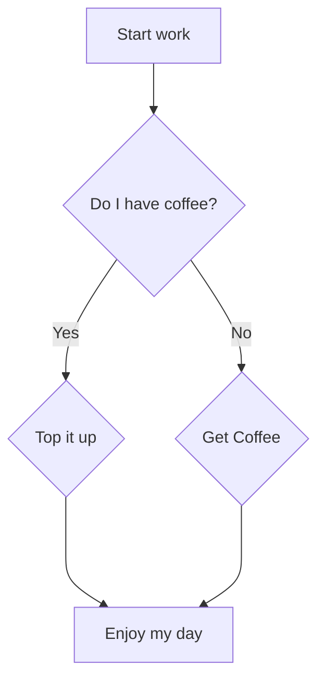

# Hi there 👋

```mermaid
    flowchart TD
        A[Start work] --> B{Do I have coffee?};
        B -- Yes --> C{Top it up};
        B -- No --> D{Get Coffee};
        C ---> E[Enjoy my day];
        D ---> E[Enjoy my day];
```

    Coding stats

### Some of my stats on Github

### How much time I spend using different languages

